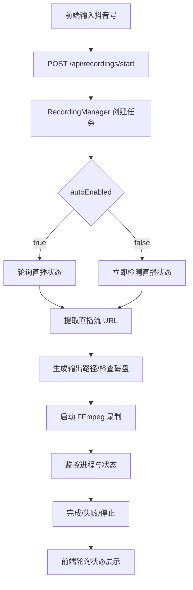

# agents.md（项目级 AI/Agent 指南）
> 本文档用于帮助 AI Agent（如 Codex、Copilot、ChatGPT）快速理解并安全地在本仓库中工作。 
> 内容包含：项目目录结构、代码风格与命名规范、构建启动命令、主要依赖组件（后端/前端）、以及配置文件关键配置项说明。 
> **要求：后续补全文档时请严格保持章节顺序与标题不变。**

---

## 1. 项目概览

- 项目名称：douyin-extra（后端）/ douyin-extra-frontend（前端）
- 项目类型：（全栈 / Monorepo）
- 核心职责与主要功能：抖音直播录制后端服务 + 前端任务管理界面
- 高层架构概述：前端 Vue 3 调用后端 Spring Boot REST API；后端负责直播检测、流地址提取、FFmpeg 录制与任务管理
- 技术栈总览：
  - 后端：Spring Boot 3.2.1、Java 17、Maven、OkHttp、Logback、Actuator
  - 前端：Vue 3、Vite、TypeScript、Pinia、Vue Router、Axios
  - 基础设施/中间件：FFmpeg（本机依赖）、本地文件系统

TODO(need-confirmation)：无

---

### 1.1 项目主要功能

- 创建录制任务（/api/recordings/start）
- 录制任务状态查询与列表展示（/api/recordings/{taskId}/status、/api/recordings）
- 停止录制任务（/api/recordings/{taskId}/stop）
- 直播状态检测与自动等待开播（recording.auto-enabled 控制）
- FFmpeg 录制与文件输出（mp4）
- 健康检查（/actuator/health）
- 运行时更新抖音 Cookie（/api/config/cookie）

TODO(need-confirmation)：无

### 1.2 主要功能业务流程图



TODO(need-confirmation)：无

---

## 2. 项目目录结构

### 2.1 顶层目录结构（Top-Level）
> 请用 tree 形式展示顶层关键目录，并为每个目录写一句职责说明。
```text
.
├── .git/                  # Git 元数据
├── .idea/                 # IDE 配置（本地使用）
├── doc/                   # 项目文档与流程图
├── douyin-extra/          # 后端 Spring Boot 服务
├── douyin-extra-frontend/ # 前端 Vue 3 应用
├── .gitignore
└── AGENTS.md
```

### 2.2 后端目录结构（如存在）
- 模块划分方式：单模块 Spring Boot 应用（douyin-extra）
- 分层结构约定：controller / service / infrastructure / model / dto / exception / validation / config
- 公共模块/通用组件位置：infrastructure（HTTP/FFmpeg/文件系统等通用能力）
- 领域模型（DTO/VO/Entity/DO）组织方式：DTO 位于 `douyin-extra/src/main/java/com/douyin/liverecorder/dto`，领域模型位于 `douyin-extra/src/main/java/com/douyin/liverecorder/model`，未发现 VO/Entity/DO

### 2.3 前端目录结构（如存在）
- 页面与路由：`douyin-extra-frontend/src/views` + `douyin-extra-frontend/src/router/index.ts`
- 组件组织方式：`douyin-extra-frontend/src/components`
- 状态管理：`douyin-extra-frontend/src/stores`（Pinia）
- API 封装与请求层：`douyin-extra-frontend/src/services/http.ts`、`douyin-extra-frontend/src/services/api.ts`
- 工具库与通用方法：`douyin-extra-frontend/src/utils`

TODO(need-confirmation)：无

---

## 3. 代码风格与规范
### 3.1 通用规范（General）
- 使用UTF-8编码读取文件、编写文件（强制）
- 注释语言：中文（仓库内 Java/前端注释为中文，但存在 Windows 编码显示问题，见 `douyin-extra/ENCODING_FIX.md`）
- 格式化/静态检查工具：未发现 `.editorconfig`、ESLint、Prettier、Checkstyle、Spotless 配置文件

### 3.2 命名规范（Naming Conventions）
#### 3.2.1 变量与方法命名
- 命名风格：camelCase（示例：`startRecording`、`recordingManager`）
- 动词-名词规则：`getTaskStatus`、`startRecording`、`stopRecording`
- 禁止/避免的缩写：未在仓库中明确约束（TODO）

#### 3.2.2 类与文件命名

- 类命名：PascalCase（示例：`RecordingController`、`LiveStreamDetector`）
- 文件命名：Java 类文件与类同名；Vue 组件使用 PascalCase（示例：`RecordingCard.vue`）
- 类与文件的对应关系：一类一文件（Java）、一组件一文件（Vue）

#### 3.2.3 常量与枚举
- 常量命名：未发现统一常量类（TODO）
- 枚举命名与枚举值命名：`TaskStatus`、`RecordingStatusType` 等为 PascalCase；枚举值为 UPPER_SNAKE_CASE（示例：`PENDING`、`RECORDING`）
- 放置位置：Java 枚举与模型位于 `douyin-extra/src/main/java/com/douyin/liverecorder/model`
#### 3.2.4 数据库字段与 API 字段（如适用）
- 数据库字段命名：未发现数据库相关实现
- JSON 字段命名：camelCase（示例：`taskId`、`douyinId`、`outputPath`）
- 前后端字段映射规则：前后端均使用 camelCase，未发现显式字段映射注解

### 3.3 代码组织约定（Code Organization Rules）
- 单文件/单模块职责边界：controller 仅处理 HTTP；service 处理业务；infrastructure 封装 FFmpeg/HTTP/文件系统
- 允许的依赖方向：controller -> service -> infrastructure/model/dto
- 禁止的写法：未定义统一约束（TODO）
- 错误处理与日志规范：`GlobalExceptionHandler` 统一异常返回；日志使用 SLF4J + Logback（见 `douyin-extra/src/main/resources/logback-spring.xml`）

TODO(need-confirmation)：
- 禁止/避免的缩写规范
- 常量统一放置规则
- 代码层级禁止跨层约束的强制规则

---

## 4. 构建与启动（Build & Run）
### 4.1 环境要求（Environment Requirements）
- 操作系统：Windows（提供 `douyin-extra/start.bat`、`douyin-extra/start-cn.bat`）
- 必需运行时：
    - JDK：17（`douyin-extra/pom.xml`）
    - Node.js：TODO(need-confirmation)
    - 其他：FFmpeg（`douyin-extra/src/main/resources/application.properties`）
- 必需工具：Maven Wrapper（`douyin-extra/mvnw.cmd`）、npm（`douyin-extra-frontend/package.json`）
- 关键环境变量：TODO(need-confirmation)
### 4.2 后端构建与启动
> 请给出可直接执行的命令；提供 cmd 版本。
```bat
cd /d douyin-extra

REM 构建
mvnw.cmd clean package -DskipTests

REM 启动（方式一：运行 jar）
java -jar target\\douyin-live-recorder-1.0.0.jar

REM 启动（方式二：Spring Boot 运行）
mvnw.cmd spring-boot:run

REM 启动（方式三：脚本）
start.bat
```

### 4.3 前端构建与启动
```bat
cd /d douyin-extra-frontend

REM 安装依赖
npm install

REM 本地启动
npm run dev

REM 生产构建
npm run build

REM 预览构建产物
npm run preview
```

TODO(need-confirmation)：
- Node.js 版本要求
- 是否需要额外系统依赖（除 FFmpeg 外）

---

## 5. 主要依赖组件（Key Dependencies）
### 5.1 后端核心依赖

- 框架：Spring Boot 3.2.1（`douyin-extra/pom.xml`）
- ORM/数据库访问：未发现 MyBatis/JPA 依赖
- 数据库：未发现数据库依赖
- 缓存：未发现 Redis 依赖
- 消息队列：未发现 MQ 依赖
- 鉴权/安全：未发现 Spring Security/JWT/OAuth2 依赖
- 日志与监控：Logback（含 JSON 输出）、Actuator
### 5.2 前端核心依赖

- 框架：Vue 3（`douyin-extra-frontend/package.json`）
- UI 组件库：未发现第三方 UI 组件库依赖
- 状态管理：Pinia
- 构建工具：Vite
- 请求库：Axios
### 5.3 基础设施/中间件（如有）
- 容器化：未发现 Docker/Compose
- CI/CD：未发现配置
- 网关/反向代理：未发现 Nginx 配置
- 可观测性：Spring Boot Actuator（健康检查）

TODO(need-confirmation)：无

---

## 6. 配置文件说明（Configuration）
### 6.1 全局配置

- 配置文件路径与命名：
  - 后端：`douyin-extra/src/main/resources/application.properties`、`douyin-extra/src/main/resources/logback-spring.xml`
  - 前端：`douyin-extra-frontend/.env`、`douyin-extra-frontend/vite.config.ts`
- 环境区分方式：未发现 profiles 或多环境配置文件
- 敏感信息管理方式：`douyin.cookie` 支持空值与 cookie 文件（`douyin.cookie-file`），未发现密钥管理方案
### 6.2 后端主要配置项
> 按功能分组，标出关键配置
- 服务端口与上下文：`server.port=8080`
- 应用名称：`spring.application.name=douyin-live-recorder`
- 录制配置：`recording.storage.path`、`recording.max-concurrent-tasks`、`recording.detection-timeout`、`recording.stop-timeout`、`recording.auto-enabled`、`recording.poll-interval-ms`、`recording.max-wait-ms`、`recording.end-detect-grace-ms`、`recording.task-log-path`
- FFmpeg：`ffmpeg.path`、`ffmpeg.output-format`
- HTTP 客户端：`http.client.connect-timeout`、`http.client.read-timeout`、`http.client.max-retries`、`http.client.retry-interval`
- 抖音请求头：`douyin.cookie`、`douyin.cookie-file`、`douyin.referer`
- 日志与监控：`logging.*`、`management.endpoints.web.exposure.include`、`management.endpoint.health.show-details`

### 6.3 前端主要配置项
- 环境变量：`douyin-extra-frontend/.env` 中 `VITE_API_BASE_URL`
- API baseUrl / 代理配置：`douyin-extra-frontend/vite.config.ts` 中 `server.proxy['/api']` 与 `server.proxy['/actuator']`
- 构建相关配置：未发现自定义 `build` 配置项
- 特性开关/运行时配置：未发现

TODO(need-confirmation)：
- 是否存在不同环境的配置（如 .env.development/.env.production）
- 是否有容器化或部署相关配置文件

---

## 7. 面向 Agent 的开发规则（Development Rules for Agents）
> 该章节用于约束 AI 变更范围，避免破坏工程约定。请用“必须/禁止/建议”的形式输出规则。
- **禁止** 在未明确指示下修改数据库 schema/迁移文件（仓库未发现数据库实现）
- **禁止** 直接修改构建产物目录：`douyin-extra/target/`（`douyin-extra/start.bat` 引用 `target\\douyin-live-recorder-1.0.0.jar`）
- **禁止** 随意修改锁文件：仅在变更依赖时允许修改 `douyin-extra-frontend/package-lock.json`
- **必须** 修改接口契约（请求/响应字段）时同步更新前后端（`douyin-extra/src/main/java/.../dto` 与 `douyin-extra-frontend/src/types`、`douyin-extra-frontend/src/services/api.ts`）
- **必须** 修改公共组件/通用服务（如 `douyin-extra-frontend/src/components`、`douyin-extra-frontend/src/services`、`douyin-extra/src/main/java/.../infrastructure`）前先评估复用影响与回归风险
- **建议** 新增依赖前评估可替代方案，并同步更新 `pom.xml` 或 `package.json` + `package-lock.json`，且确保测试可通过（后端：`mvnw.cmd test`；前端：`npm run test`）

TODO(need-confirmation)：
- 前端构建产物目录名称（默认 dist）是否需要禁止修改

---

## 8. 新业务与新功能开发规范（New Feature Development Rules）
> 本章节用于明确在开发新的业务或功能时，AI Agent 与开发者必须遵守的技术与实现约束，以保证项目的技术一致性与可维护性。
### 8.1 技术栈使用约束（强制）

- **必须使用项目中已存在的前端与后端技术栈**完成新业务或新功能开发。
- **禁止**因实现单一功能而：
    - 引入新的前端/后端框架
    - 引入同类但不同实现的库（例如已使用 axios 时引入新的请求封装）
    - 引入功能重复或能力重叠的第三方依赖
- 如确实需要新增依赖：
    - **必须**明确说明现有技术栈无法满足的原因
    - 需要评估对构建体积、性能、维护成本的影响
    - 未经明确指示，**默认不允许新增依赖**

### 8.2 复用优先原则（强制）

- 在实现新功能前，**必须优先查找并复用项目中已存在的能力**，包括但不限于：
    - 后端已有工具类（`douyin-extra/src/main/java/.../infrastructure`）
    - 通用业务组件/公共服务
    - 前端通用组件、stores、services、utils
- **禁止**在以下场景中重复造轮子：
    - 项目中已存在功能等价或高度相似的实现
    - 通过简单抽象扩展即可满足需求的场景

### 8.3 新代码组织规范
- 新业务代码必须：
    - 放置在现有约定的模块与目录结构中
    - 遵循既有分层与职责划分（controller/service/infrastructure/model/dto）
- 禁止：
    - 为单一功能创建“孤立模块”或“临时目录”
    - 绕过公共层，在业务代码中实现通用逻辑
- 若新功能具备复用价值：
    - 应提取为公共组件/公共服务
    - 并放置在项目约定的公共模块中

### 8.4 实现方式与风格一致性
- 新增代码必须与现有代码在以下方面保持一致：
    - 命名风格（类名、方法名、变量名、字段名）
    - 异常处理方式（统一异常处理与错误响应）
    - 日志记录规范（SLF4J + Logback）
    - 参数校验与返回结果（Bean Validation + DTO）
- 禁止引入与现有风格明显不一致的实现方式（如不同的异步模型或状态管理模式）
### 8.5 Agent 特别约束（重要）

- AI Agent 在开发新业务/功能时：
    - **不得擅自引入新依赖或新技术方案**
    - **不得绕过现有工具类与公共组件**
    - 如发现现有能力不足，只能：
        - 标注 `TODO(need-confirmation)`
        - 并说明缺失能力与影响范围
- 在未获得明确指示前，**优先选择“最小改动、最大复用”的实现方案**

TODO(need-confirmation)：无

