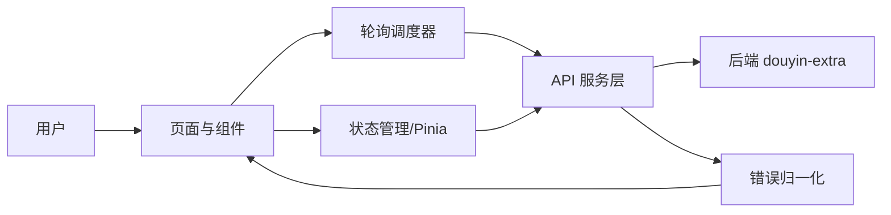
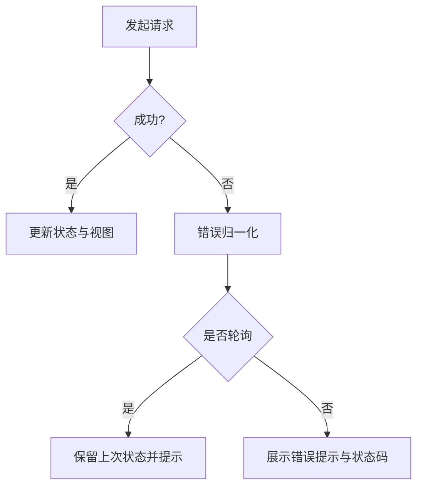

# 设计文档

## 概述
本设计用于构建 douyin-extra-frontend（Vue3 + Vite + TypeScript）前端管理界面，通过录制任务总览、任务详情与运行时配置（Cookie）实现对后端录制系统的可视化与控制；轮询用于持续刷新任务状态与列表，保证进度与结果可见。

### 设计目标
- 支持录制任务创建、停止、列表与详情展示
- 通过轮询保证任务状态与列表的实时性
- 统一状态映射与错误提示，提升可读性
- 提供 Cookie 更新入口并强调安全提示
- 便于扩展健康检查与后续能力

### 技术栈
- 前端框架：Vue 3 + Vite + TypeScript
- 路由：Vue Router
- 状态管理：Pinia
- HTTP：Axios（封装统一错误处理）
- 样式：原生 CSS/SCSS（不引入 UI 组件库）
- 测试：Vitest + @vue/test-utils + MSW

## 架构
### 系统结构图


### 组件关系
- 录制任务总览页：承载创建、列表、状态总览与刷新入口
- 任务卡片组件：展示单任务摘要、停止按钮与状态标识
- 任务详情弹窗/侧栏：展示 taskId、进度、错误与输出信息
- Cookie 配置面板：提交 Cookie 并提示安全风险
- 健康检查面板（可选）：展示系统可用性摘要

## 组件和接口
### 1. 页面层服务
- 职责
  - 组合业务组件，组织页面布局与交互
  - 触发任务创建、停止、详情查看与 Cookie 更新
- 接口
```ts
// 录制任务总览页
function onStartRecording(douyinId: string, auto: boolean): Promise<void>
function onRefreshList(): Promise<void>
function onOpenDetail(taskId: string): void

// Cookie 配置页
function onUpdateCookie(cookie: string): Promise<void>
```
- 必要实现细节
  - 输入校验与提交禁用状态
  - 将错误信息统一交由错误处理器展示

### 2. 组件层服务
- 职责
  - 展示任务卡片与详情
  - 复用状态徽标与进度展示
- 接口
```ts
interface RecordingCardProps {
  taskId: string
  status: string
  outputPath?: string | null
  fileSize?: number | null
  error?: string | null
}

interface RecordingDetailProps {
  taskId: string
  status: string
  progress?: {
    duration?: number
    fileSize?: number
    bitrate?: string
  }
  outputPath?: string | null
  error?: string | null
}
```
- 必要实现细节
  - 状态颜色映射来自统一映射表
  - 详情面板关闭不清空缓存数据

### 3. 状态管理层服务
- 职责
  - 维护任务列表、任务详情与轮询状态
  - 提供状态更新与详情缓存
- 接口
```ts
// Pinia Store
interface RecordingStore {
  list: RecordingResponse[]
  statusMap: Record<string, RecordingStatus>
  loading: boolean
  error?: string

  fetchList(): Promise<void>
  fetchStatus(taskId: string): Promise<void>
  startRecording(douyinId: string, auto: boolean): Promise<void>
  stopRecording(taskId: string): Promise<void>
}
```
- 必要实现细节
  - 列表刷新与详情状态合并时以最新状态为准
  - 轮询停止条件：状态进入 COMPLETED/FAILED/CANCELLED

### 4. API 服务层服务
- 职责
  - 封装后端接口调用与错误归一化
- 接口
```ts
// 请求与响应类型
interface StartRecordingRequest { douyinId: string; auto?: boolean }

function apiStartRecording(payload: StartRecordingRequest): Promise<RecordingResponse>
function apiStopRecording(taskId: string): Promise<RecordingResponse>
function apiGetStatus(taskId: string): Promise<RecordingStatus>
function apiListRecordings(): Promise<RecordingResponse[]>
function apiUpdateCookie(cookie: string): Promise<void>
function apiHealth(): Promise<HealthResponse>
```
- 必要实现细节
  - 统一处理 400/429/503 等状态码
  - 所有异常转换为统一错误对象供 UI 展示

### 5. 轮询调度层服务
- 职责
  - 控制列表轮询与单任务状态轮询
  - 在页面不可见时降低频率或暂停
- 接口
```ts
interface PollingController {
  startListPolling(intervalMs: number): void
  stopListPolling(): void
  startTaskPolling(taskId: string, intervalMs: number): void
  stopTaskPolling(taskId: string): void
}
```
- 必要实现细节
  - 任务轮询频率 2-5 秒
  - 列表轮询频率 10-30 秒
  - 轮询失败时保留上次有效状态

### 6. 通用基础设施层服务
- 职责
  - 提供 HTTP 客户端、状态映射、错误提示与格式化工具
- 接口
```ts
// 状态映射
const statusColorMap: Record<string, string> = {
  PENDING: 'gray',
  DETECTING: 'gray',
  RECORDING: 'green',
  STOPPING: 'yellow',
  COMPLETED: 'blue',
  FAILED: 'red',
  CANCELLED: 'red',
}

// 错误归一化
function normalizeError(input: unknown): { message: string; status?: number; path?: string }
```
- 必要实现细节
  - 统一使用 ErrorResponse.message 优先展示
  - Cookie 内容在日志与提示中脱敏

## 数据模型
### 请求消息格式
```json
{
  "startRecording": {
    "douyinId": "string",
    "auto": true
  },
  "updateCookie": {
    "cookie": "string"
  }
}
```

### 响应消息格式
```json
{
  "recordingResponse": {
    "taskId": "string",
    "douyinId": "string",
    "status": "PENDING|DETECTING|RECORDING|STOPPING|COMPLETED|FAILED|CANCELLED",
    "streamUrl": "string|null",
    "outputPath": "string|null",
    "startTime": "2026-01-03T14:30:25",
    "endTime": "2026-01-03T15:30:25|null",
    "fileSize": 123456,
    "error": "string|null"
  },
  "recordingStatus": {
    "taskId": "string",
    "status": "PENDING|DETECTING|RECORDING|STOPPING|COMPLETED|FAILED|CANCELLED",
    "progress": {
      "duration": 120,
      "fileSize": 15728640,
      "bitrate": "1024kbps"
    },
    "error": "string|null"
  },
  "errorResponse": {
    "timestamp": "2026-01-03T14:30:25",
    "status": 400,
    "error": "错误类型",
    "message": "错误描述",
    "path": "/api/recordings/start"
  }
}
```

### 错误代码定义
| 状态码 | 场景 | 前端提示 |
| --- | --- | --- |
| 400 | 输入校验失败 | 输入格式错误，请检查抖音号或 Cookie |
| 404 | 任务不存在 | 任务不存在或已被清理 |
| 429 | 并发限制 | 任务过多，请稍后重试 |
| 500 | 服务内部错误 | 服务异常，请稍后再试 |
| 503 | 网络或服务不可用 | 服务不可用，请检查网络 |

## 正确性属性
## 属性1: 任务创建一致性
- 验证需求：1.1, 1.2
- 说明：创建请求成功后列表必须出现新任务卡片

## 属性2: 列表与状态轮询准确性
- 验证需求：2.1, 2.2, 2.3, 2.4
- 说明：轮询频率符合要求，终态停止轮询并保留最新状态

## 属性3: 任务详情完整性
- 验证需求：3.1, 3.2, 3.3
- 说明：详情视图覆盖关键信息且关闭后不丢失数据

## 属性4: 停止操作安全性
- 验证需求：4.1, 4.2, 4.3
- 说明：停止操作仅在允许状态下可用并正确反馈

## 属性5: Cookie 更新可靠性
- 验证需求：5.1, 5.2, 5.3
- 说明：更新成功后提示并清空输入，展示安全提示

## 属性6: 状态映射一致性
- 验证需求：6.1, 6.2, 6.3, 6.4, 6.5, 6.6, 6.7
- 说明：颜色与错误提示统一，错误信息优先 message

## 属性7: 健康检查可用性
- 验证需求：7.1
- 说明：健康检查接口可用时正确展示摘要

## 错误处理
### 错误处理策略
- 网络异常：提示网络错误并保留上次有效数据
- 后端异常：展示 ErrorResponse.message 并附带状态码与路径
- 业务校验失败：提示输入错误并高亮输入框
- 轮询异常：不中断页面，等待下一次轮询重试
- 并发限制：提示 429 并禁止短时间内重复提交

### 错误处理流程图


## 测试策略
- 单元测试
  - 状态映射与显示逻辑
  - 错误归一化逻辑
  - 轮询停止条件
- 属性测试
  - 配置与标签一致性
```ts
const statusLabelMap = {
  PENDING: '等待中',
  DETECTING: '检测中',
  RECORDING: '录制中',
  STOPPING: '停止中',
  COMPLETED: '已完成',
  FAILED: '失败',
  CANCELLED: '已取消',
}
```
  - 验证所有状态都具备颜色与标签配置
- 集成测试
  - 创建任务 -> 列表出现 -> 详情打开
  - 停止任务 -> 状态更新
  - Cookie 更新 -> 204 成功提示
- 测试工具和框架
  - Vitest、@vue/test-utils、MSW
- 测试数据
  - 使用模拟 RecordingResponse/RecordingStatus
  - 提供成功/失败/限流等场景数据

## 实现注意事项
- 性能考虑
  - 列表轮询 10-30 秒，任务轮询 2-5 秒
  - 页面不可见时暂停或降低轮询频率
  - 列表刷新与详情状态合并避免重复渲染
- 安全考虑
  - Cookie 输入框默认隐藏明文，提交前提示风险
  - 日志与错误提示中对 Cookie 脱敏
- 可扩展性
  - 状态映射集中管理，便于扩展新状态
  - API baseURL 使用环境变量配置
- 监控和日志
  - 记录关键请求失败原因
  - 提供基础的错误上报接口预留
