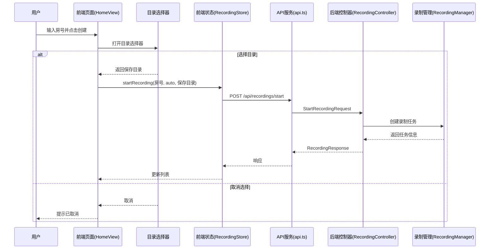
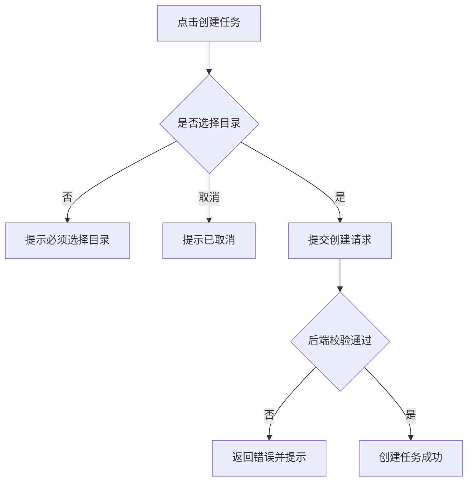

# 设计文档

## 概述
本次二期优化在现有抖音直播录制流程中加入“保存目录选择”环节：用户输入直播间房号并点击创建任务后，前端弹出目录选择器，用户确认目录后才会创建录制任务，并将所选目录作为录制文件保存位置，同时系统记住上次目录以便下次默认使用。

### 设计目标
- 录制任务创建前强制选择保存目录，避免默认路径误用
- 记录并默认使用上次选择目录，提高操作效率
- 取消选择时不创建任务，保证流程可控

### 技术栈
- 前端：Vue 3、Vite、TypeScript、Pinia、Axios
- 后端：Spring Boot 3.2.1、Java 17
- 客户端存储：localStorage

## 架构
### 系统结构图


### 组件关系
- 前端交互层负责触发目录选择与展示反馈
- 前端状态层负责保存上次目录与提交任务请求
- API 服务层负责封装后端请求
- 后端控制器负责参数校验与请求转发
- 录制管理层负责输出路径生成与录制启动

## 组件和接口
### 1. 前端交互层服务
- 职责
  - 在创建任务前弹出目录选择器
  - 处理取消/确认结果并提示用户
- 接口
```ts
// 目录选择器交互
interface DirectoryPickerResult {
  cancelled: boolean
  outputDir?: string
}

function openDirectoryPicker(defaultDir?: string): Promise<DirectoryPickerResult>
```
- 必要的实现细节或验证规则
  - 打开时读取本地记录的上次目录作为默认值显示
  - 用户取消时返回 cancelled=true

### 2. 前端状态与本地存储服务
- 职责
  - 记录上次保存目录
  - 组织并提交创建任务参数
- 接口
```ts
// Pinia store 动作
async function startRecording(douyinId: string, auto: boolean, outputDir: string): Promise<string>

// 本地存储键
const LAST_DIR_KEY = 'mp4save.lastOutputDir'
```
- 必要的实现细节或验证规则
  - 仅在任务创建成功后写入 LAST_DIR_KEY
  - outputDir 为空时禁止提交请求

### 3. 前端 API 服务层
- 职责
  - 调用后端录制创建接口
- 接口
```ts
// POST /api/recordings/start
interface StartRecordingRequest {
  douyinId: string
  auto?: boolean
  outputDir: string
}
```
- 必要的实现细节或验证规则
  - outputDir 为空时不发送请求

### 4. 后端接口层服务
- 职责
  - 接收创建录制任务请求并校验参数
- 接口
```java
@PostMapping("/api/recordings/start")
ResponseEntity<RecordingResponse> startRecording(@Valid @RequestBody StartRecordingRequest request)
```
- 必要的实现细节或验证规则
  - outputDir 必填且非空白
  - outputDir 必须为可写目录（存在且可创建文件）

### 5. 后端录制管理服务
- 职责
  - 基于 outputDir 生成输出文件路径
  - 启动录制并保存任务信息
- 接口
```java
RecordingTask createTask(String douyinId, Boolean auto, String outputDir)
```
- 必要的实现细节或验证规则
  - 在 outputDir 下生成唯一文件名
  - 输出路径冲突时进行重命名或拒绝

## 数据模型
### 请求消息格式
```json
{
  "douyinId": "1234567890",
  "auto": true,
  "outputDir": "D:\\Recordings"
}
```

### 响应消息格式
```json
{
  "taskId": "f2c9f0c6",
  "douyinId": "1234567890",
  "status": "WAITING",
  "streamUrl": null,
  "outputPath": "D:\\Recordings\\douyin_1234567890_20240101.mp4",
  "startTime": "2024-01-01T10:00:00",
  "endTime": null,
  "fileSize": null,
  "error": null
}
```

### 错误代码定义
| 错误码 | HTTP 状态 | 描述 | 触发条件 |
| --- | --- | --- | --- |
| SAVE_DIR_REQUIRED | 400 | 保存目录必填 | outputDir 为空或空白 |
| SAVE_DIR_INVALID | 400 | 保存目录不可用 | 目录不存在或不可写 |

## 正确性属性
## 属性1: 录制前必须选择保存目录
验证需求：需求1.1、需求1.2、需求1.3
- 目录选择未完成时不允许创建任务
- 选择后必须将目录带入创建请求

## 属性2: 记住上次保存目录
验证需求：需求2.1、需求2.2
- 创建成功后保存上次目录
- 下次打开目录选择器时默认显示该目录

## 属性3: 取消选择不创建任务
验证需求：需求3.1、需求3.2
- 取消时不发送创建请求
- 任务列表无新增项

## 错误处理
### 错误处理策略
- 前端校验 outputDir 为空时直接提示，不触发请求
- 后端校验 outputDir 非空且可写，不满足则返回错误码
- 用户取消目录选择时提示“已取消”，不改变任务列表

### 错误处理流程图


## 测试策略
单元测试：
- 目录选择结果处理：确认/取消分支
- 本地存储写入逻辑：仅成功后写入
- 请求参数拼装：outputDir 必填

属性测试：
配置：使用 LAST_DIR_KEY 保存目录，模拟不同目录值
标签格式：
```text
@feature:mp4save
@attr:save-dir-required
@attr:save-dir-remember
@attr:save-dir-cancel
```
测试列表：
1. 未选择目录时无法创建任务
2. 选择目录后成功创建并记录目录
3. 取消目录选择后任务列表无新增

集成测试：
- POST /api/recordings/start 在 outputDir 为空时返回 400
- POST /api/recordings/start 在 outputDir 不可写时返回 400
- POST /api/recordings/start 正常返回 RecordingResponse

测试工具和框架：
- 后端：JUnit 5（Spring Boot 默认）
- 前端：使用项目现有测试方式（如未配置则先补齐基础单测能力）

测试数据：
- 本地可写目录与不可写目录各一组
- 示例抖音号与录制参数组合

## 实现注意事项
- 性能考虑：目录选择仅在创建前触发，不应影响录制轮询性能
- 安全考虑：后端必须校验 outputDir 为可写目录，避免非法路径写入
- 可扩展性：可扩展为“常用目录列表”或“多目录管理”
- 监控和日志：记录每次任务创建的 outputDir 与校验失败原因
